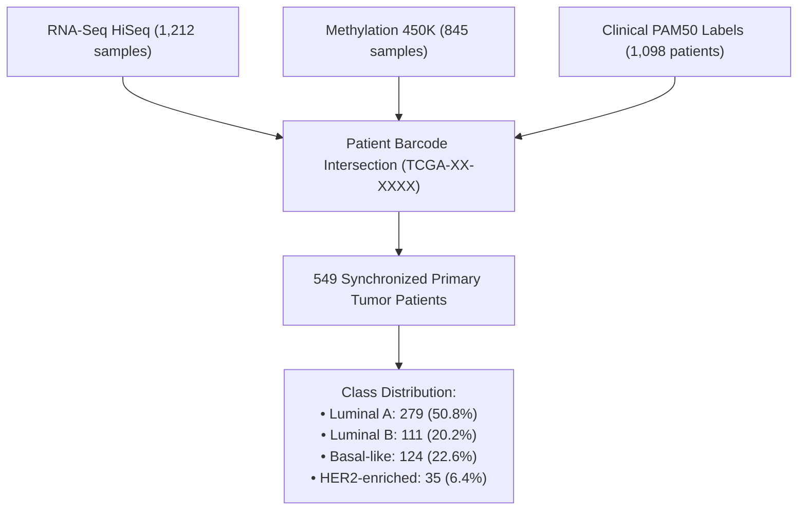

# 🧬 TCGA-BRCA Multi-Omics Dataset

This directory stores the primary multi-omics and clinical datasets for the **TCGA Breast Invasive Carcinoma (BRCA)** cohort, retrieved from the **Broad Institute GDAC Firehose** (Data Release: `2016_01_28`).

---

## 📥 Required Raw Data Files

The pipeline expects three source files located in `data/`:

| File Name | Data Type | Dimensions / Size | Platform / Technology | Description |
| :--- | :--- | :--- | :--- | :--- |
| `Human_TCGA_BRCA_UNC_RNAseq_HiSeq_RNA_01_28_2016_BI_Gene_Firehose.gz` | Transcriptomics (RNA-Seq) | 20,531 genes × 1,212 samples (~52 MB) | Illumina HiSeq 2000 (RSEM normalized counts) | Log2-transformed gene-level normalized mRNA expression |
| `Human_TCGA_BRCA_JHU_USC_Methylation_Meth450_01_28_2016_BI_Gene_Firehose.gz` | Epigenomics (DNA Methylation) | 20,107 genes × 845 samples (~33 MB) | Illumina Infinium HumanMethylation450 BeadChip | Beta values ($\beta \in [0, 1]$) aggregated at gene-level promoter regions |
| `Human_TCGA_BRCA_MS_Clinical_Clinical_01_28_2016_BI_Clinical_Firehose.tsi` | Clinical & Phenotypic Data | 111 features × 1,098 patients (~150 KB) | Curated TCGA Clinical Annotations | Patient metadata including PAM50 subtype classification |

---

## 🔄 Patient Harmonization & Overlap

Not all TCGA-BRCA patients have both RNA-Seq and Methylation profiles along with a confirmed PAM50 subtype.

- **Target Variable**: PAM50 intrinsic breast cancer subtype (`PAM50_Subtype` or `PAM50Call_RNAseq`).
- **Normal Tissue Exclusion**: All non-primary tumor samples (barcodes ending in `-11` normal tissue) are filtered out during synchronization in `Reading.ipynb`.

---

## ⚙️ Data Preprocessing Summary

1. **Patient Barcode Harmonization**: Sample barcodes are truncated to the first 12 characters (`TCGA-XX-XXXX`) to align across molecular and clinical layers.
2. **Train/Test Splitting**: Stratified 80/20 train/test split executed immediately in `preprocessing.ipynb` to guarantee zero data leakage ($N_{train} = 439$, $N_{test} = 110$).
3. **Missing Value Imputation**: Gene-level median imputation fit strictly on $X_{train}$ and applied to $X_{test}$ with `keep_empty_features=True`.
4. **Log2 Transformation**: Applied to RNA-Seq count data ($\log_2(\text{counts} + 1)$).
5. **MinMax Normalization**: Rescaling feature values to $[0, 1]$ prior to distance-based metric calculations.

---

## 📜 Citation & Source Acknowledgement

- **Data Source**: [Broad Institute TCGA GDAC Firehose](https://gdac.broadinstitute.org/)
- **Primary Reference**: Cancer Genome Atlas Network. *Comprehensive molecular portraits of human breast tumours.* Nature 490, 61–70 (2012). https://doi.org/10.1038/nature11412
