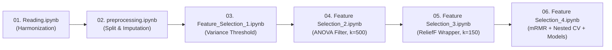

# 📓 Jupyter Notebooks Pipeline

This directory contains the interactive, step-by-step implementation of the **Breast-Cancer-MultiOmics** workflow. The 6 sequential notebooks demonstrate every phase from raw data ingestion to nested cross-validation, hyperparameter tuning, and biological pathway validation.

---

## 🗺️ Sequential Execution Flow

---

## 📋 Notebook Descriptions & Specifications

### 1. `Reading.ipynb`
- **Objective**: Ingest raw TCGA-BRCA Firehose files (RNA-Seq, Methylation 450K, and Clinical metadata) and harmonize patient barcodes (`TCGA-XX-XXXX`).
- **Key Operations**:
  - Filter out normal tissue aliquots (keep only primary tumor barcodes).
  - Synchronize samples across all three data layers ($N = 549$).
  - Encode PAM50 subtype labels: `LumA` (0), `LumB` (1), `Her2` (2), `Basal` (3).
- **Outputs Produced**: `outputs/X_rna_raw.parquet`, `outputs/X_meth_raw.parquet`, `outputs/y_labels.parquet`, `outputs/patient_ids.pkl`.

---

### 2. `preprocessing.ipynb`
- **Objective**: Establish the isolated test set and perform missing value imputation and scaling safeguards.
- **Key Operations**:
  - **Stratified Train/Test Split**: 80% train ($N=439$), 20% test ($N=110$) with `random_state=100`.
  - **Strict Leak Prevention**: Imputer parameters (medians) are learned exclusively on `X_train` and applied to `X_test`.
  - `keep_empty_features=True` parameter ensures column shape parity across train and test sets.
- **Outputs Produced**: `outputs/X_train_rna_imp.npz`, `outputs/X_test_rna_imp.npz`, `outputs/X_train_meth_imp.npz`, `outputs/X_test_meth_imp.npz`, `outputs/y_train.parquet`, `outputs/y_test.parquet`.

---

### 3. `Feature_Selection_1.ipynb`
- **Objective**: Remove non-informative, quasi-constant genes and CpG loci using Variance Thresholding, followed by MinMax normalization.
- **Key Operations**:
  - Variance calculated on unscaled raw data to maintain true biological variation scale.
  - Threshold set at the 20th percentile of variance for each modality independently.
  - Features with variance below threshold are discarded (~16,104 RNA and ~16,104 Methylation features retained).
  - MinMax normalization scales feature values into $[0, 1]$ for downstream distance calculations.
- **Outputs Produced**: `outputs/X_train_rna_var.npz`, `outputs/X_test_rna_var.npz`, `outputs/X_train_meth_var.npz`, `outputs/X_test_meth_var.npz`, `outputs/feat_indices_*_var.npz`.

---

### 4. `Feature Selection_2.ipynb`
- **Objective**: Select top 500 statistically significant features per modality using univariate analysis of variance (ANOVA F-value).
- **Key Operations**:
  - Compute one-way ANOVA F-score ($F = \frac{\text{MSB}}{\text{MSW}}$) for each feature across the 4 PAM50 classes.
  - Rank features by F-statistic and select top $k=500$ for RNA-Seq and top $k=500$ for Methylation (total 1,000 features).
  - Evaluate filter quality via 5-Fold Stratified Cross-Validation on training data only (no test set leakage).
- **Outputs Produced**: `outputs/X_train_rna_anova.npz`, `outputs/X_test_rna_anova.npz`, `outputs/X_train_meth_anova.npz`, `outputs/X_test_meth_anova.npz`, `outputs/feat_indices_*_anova.npz`.

---

### 5. `Feature Selection_3.ipynb`
- **Objective**: Refine feature space by capturing non-linear interactions and multi-class margins using the ReliefF nearest-neighbor algorithm.
- **Key Operations**:
  - Multi-class ReliefF algorithm computes feature weights based on intra-class hits and inter-class misses.
  - Features ranked by weight; top $k=150$ retained per modality (total 300 features).
  - Validation performed using 5-fold cross-validation on the training set.
- **Outputs Produced**: `outputs/X_train_rna_relief.npz`, `outputs/X_test_rna_relief.npz`, `outputs/X_train_meth_relief.npz`, `outputs/X_test_meth_relief.npz`, `outputs/feat_indices_*_relief.npz`.

---

### 6. `Feature Selection_4.ipynb`
- **Objective**: Final feature selection via mRMR, true nested cross-validation, in-fold hyperparameter tuning, final model evaluation on held-out test data, and biological validation.
- **Key Operations**:
  - **mRMR (Minimum Redundancy Maximum Relevance)**: Selects the final 50 biomarkers balancing mutual information with class labels against redundancy among selected features.
  - **In-Fold Nested CV**: `RepeatedStratifiedKFold(n_splits=5, n_repeats=2)` executes the entire FS pipeline inside each fold to ensure unbiased generalizability estimates (~89.86% Nested CV accuracy).
  - **Hyperparameter Optimization**: In-fold GridSearchCV for Linear SVM, Random Forest, and KNN.
  - **Test Evaluation**: Final models evaluated once on held-out test data ($N=110$) with 95% Bootstrap Confidence Intervals.
  - **Biological Pathway & Interactome**: Reactome pathway overrepresentation analysis and STRING PPI network confirmation.
- **Outputs Produced**: `outputs/models/` (`random_forest_model.pkl`, `svm_model.pkl`, `knn_model.pkl`), `outputs/results/` (metrics, plots, sensitivity curves, ablation study).

---

## 💡 Best Practices for Execution

1. **Kernel Selection**: Ensure your Jupyter kernel uses the project environment (`python -m ipykernel install --user --name=multiomics`).
2. **Execution Directory**: All notebooks are pre-configured to resolve directories automatically whether launched from the repository root or the `notebooks/` directory.
3. **Reproducibility**: Global random seeds (`SPLIT_SEED=100`, `RANDOM_STATE=42`) are fixed across all notebooks for exact reproducibility.
